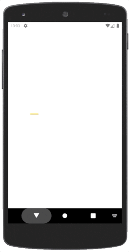

# Youst

> The player controls a **yellow knight** riding a flying ostrich or stork, from a third-person perspective.

Our goal is to make an application that will be our playground. We want to show our workflow and our best practices through a tool generated by us and for us as we grow as developers.

We are using Kotlin language and testing latest Android libraries. It'll be updated with new features as they come to the Android development world.

## Showcase

## Getting Started

Please refer to the [contributing](./CONTRIBUTING.md) file to see our contribution guidelines and also our [workflow](./WORKFLOW.md) file to see our development workflow.

## Android Studio IDE setup

Youst requires Android Studio version 3.5 or higher.